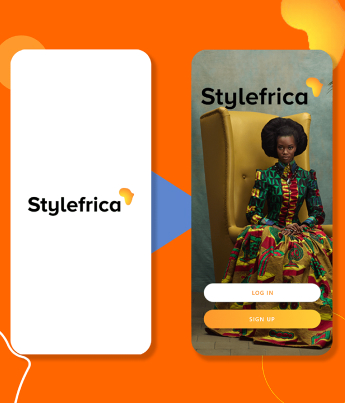
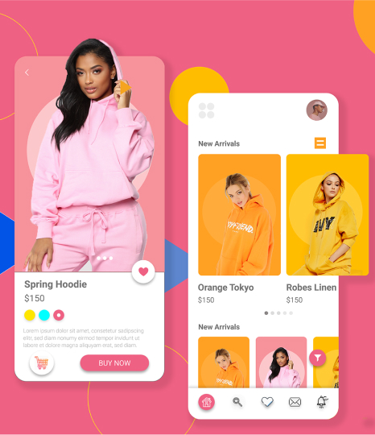
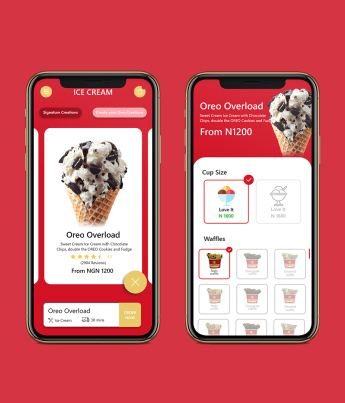
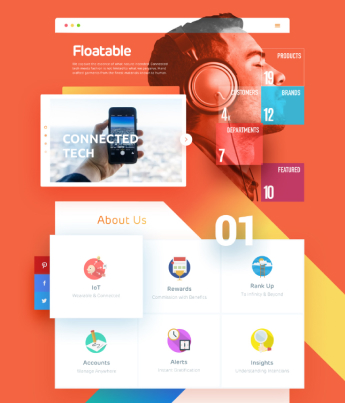

<!DOCTYPE html>
<html lang="en">
<head>
    <meta charset="UTF-8">
    <meta name="viewport" content="width=device-width, initial-scale=1.0">
    <title>Portfolio</title>
    <!-- Fonts -->
    <link href="https://fonts.googleapis.com/css2?family=Poppins:wght@100;200;300;400;500;600;700;800;900&display=swap" rel="stylesheet">
    <!-- Bootstrap -->
    <link rel="stylesheet" href="https://stackpath.bootstrapcdn.com/bootstrap/4.5.0/css/bootstrap.min.css" integrity="sha384-9aIt2nRpC12Uk9gS9baDl411NQApFmC26EwAOH8WgZl5MYYxFfc+NcPb1dKGj7Sk" crossorigin="anonymous">
    <!-- Animate CSS -->
    <link rel="stylesheet" href="https://cdnjs.cloudflare.com/ajax/libs/animate.css/4.0.0/animate.min.css">
    <!-- Font Awesome -->
    <link rel="stylesheet" href="https://cdnjs.cloudflare.com/ajax/libs/font-awesome/4.7.0/css/font-awesome.min.css">
    <!-- Custom Styles -->
    <link rel="stylesheet" href="./css/index.css" >
</head>
<body>
    <header class="header-section">
        

            

                

                    
                

                

                    <h1>
                        I'm  
                        UI/UX  
                        DESIGNER
                    </h1>
                

            

        

        <!-- Navbar -->
        <nav class="navbar navbar-expand-lg navbar-light">
            

                <a class="navbar-brand navbar-brand_custom" href="#">MENU</a>
                <button class="navbar-toggler border-0" type="button" data-toggle="collapse" data-target="#navbarNavDropdown" aria-controls="navbarNavDropdown" aria-expanded="false" aria-label="Toggle navigation">
                    <i class="fa fa-reorder text-orange"></i>
                </button>
                

                    <ul class="navbar-nav navbar-nav_custom">
                        <li class="nav-item nav-link_disappear">
                            <a class="nav-link px-4 text-orange" href="">HOME</a>
                        </li>
                        <li class="nav-item">
                            <a class="nav-link px-4" href="#about">ABOUT</a>
                        </li>
                        <li class="nav-item">
                            <a class="nav-link px-4" href="#education">EDUCATION</a>
                        </li>
                        <li class="nav-item">
                            <a class="nav-link px-4" href="#portfolio">PORTFOLIO</a>
                        </li>
                        <li class="nav-item nav-link_disappear">
                            <a class="nav-link" href="#what">WHAT I DO</a>
                        </li>
                        <li class="nav-item">
                            <a class="nav-link px-4" href="#contact">CONTACT</a>
                        </li>
                    </ul>
                

            

        </nav>
    </header>
    <!-- About Section -->
    <section class="about-section">
        

            

                

                    
                

                

                    ABOUT ME
                    
Lorem ipsum dolor sit amet consectetur, adipisicing elit. Ducimus nemo, eius rerum praesentium provident consequatur. Qui et quas est, aspernatur atque obcaecati magnam doloribus, vitae, laudantium ex earum dicta eaque. Lorem ipsum dolor sit amet, consectetur adipisicing elit. Sunt repudiandae architecto vero tenetur quaerat corrupti eaque, earum ut rem, dolor possimus ullam? Perspiciatis, ullam doloribus inventore mollitia cum fugit porro!

                    <button type="submit" class="btn-orange mr-2">Download Resume</button>
                    <button type="submit" class="btn-black">Hire Me</button>
                

            

        

    </section>
    <!-- Education Section -->
    <section class="education-section">
        

            EDUCATION
            

                

                    <h6>Junior (WEAC)</h6>
                    
All Saints School

                    
Lorem ipsum dolor sit amet, consectetur adipiscing elit. Felis tincidunt orci, metus, aenean arcu. Vitae maecenas convallis tincidunt mauris.

                

                

                    <h6>Science (WEAC)</h6>
                    
Federal Science and Technical College

                    
Lorem ipsum dolor sit amet, consectetur adipiscing elit. Felis tincidunt orci, metus, aenean arcu. Vitae maecenas convallis tincidunt mauris.

                

                

                    <h6>Computer Science (Bsc)</h6>
                    
Covenant University

                    
Lorem ipsum dolor sit amet, consectetur adipiscing elit. Felis tincidunt orci, metus, aenean arcu. Vitae maecenas convallis tincidunt mauris.

                

                

                    <h3 class="rotate rotate-up">2011</h3>
                

                

                    <h3 class="rotate rotate-up">2014</h3>
                

                

                    <h3 class="rotate rotate-up">2018</h3>
                

                

                    

                    
                    
                    
                

            

        

    </section>
    <!-- Portfolio Section -->
    <section class="portfolio-section">
        

            PORTFOLIO
            

                

                    
                

                

                    
                

                

                    
                

                

                    
                

                

                    
                

                

                    
                

            

            <button type="button" class="btn-orange">Load More</button>
        

    </section>
    <!-- What I Do Section -->
    <section class="what-section">
        

            WHAT I DO
            

                

                    

                        

                            
                            
                        

                        <h6 class="text-center">Web Development</h6>
                        
Lorem ipsum dolor sit amet consectetur adipisicing elit. Exercitationem praesentium facilis quidem.

                    

                

                

                    

                        

                            
                            
                            
                        

                        <h6 class="text-center">Web/App Design</h6>
                        
Lorem ipsum dolor sit amet consectetur adipisicing elit. Exercitationem praesentium facilis quidem.

                    

                

                

                    

                        

                            
                            
                            
                        

                        <h6 class="text-center">Graphic Design</h6>
                        
Lorem ipsum dolor sit amet consectetur adipisicing elit. Exercitationem praesentium facilis quidem.

                    

                

                

                    

                        

                            
                            
                            
                        

                        <h6 class="text-center">Logo Making</h6>
                        
Lorem ipsum dolor sit amet consectetur adipisicing elit. Exercitationem praesentium facilis quidem.

                    

                

            

        

    </section>
    <!-- Contact Section -->
    <section class="contact-section">
        

            GET IN TOUCH
            

                

                    <form>
                        

                            

                                <input type="text" class="form-control" placeholder="First name">
                            

                            

                                <input type="text" class="form-control" placeholder="Last name">
                            

                        

                        

                            <input type="text" class="form-control" placeholder="Subject">
                        

                        

                            <textarea class="form-control" rows="12" placeholder="Message"></textarea>
                        

                        <button type="submit" class="btn-orange">Submit</button>
                    </form>
                

                

                    
                    <h5 class="text-center mb-3">LET'S WORK TOGETHER</h5>
                    

                        

                            <a href=""><i class="fa fa-skype text-dark" aria-hidden="true"></i></a>
                        

                        

                            <a href=""><i class="fa fa-twitter text-dark" aria-hidden="true"></i></a>
                        

                        

                            <a href=""><i class="fa fa-linkedin text-dark" aria-hidden="true"></i></a>
                        

                        

                            <a href=""><i class="fa fa-envelope text-dark" aria-hidden="true"></i></a>
                        

                    

                

            

        

    </section>
    <!-- Footer Section -->
    <footer class="footer-section">
        

            

                
Copyright &copy; 2020

                

                    <ul class="mb-0">
                        <li class="mx-2">FACEBOOK</li>
                        <li class="mx-2">INSTAGRAM</li>
                        <li class="mx-2">TWITTER</li>
                    </ul>
                

            

        

    </footer>

    <!-- Scripts -->
    
    
    
    <!-- WOW JS -->
    
    
    
</body>
</html>